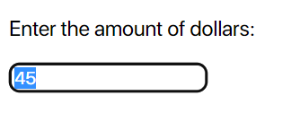
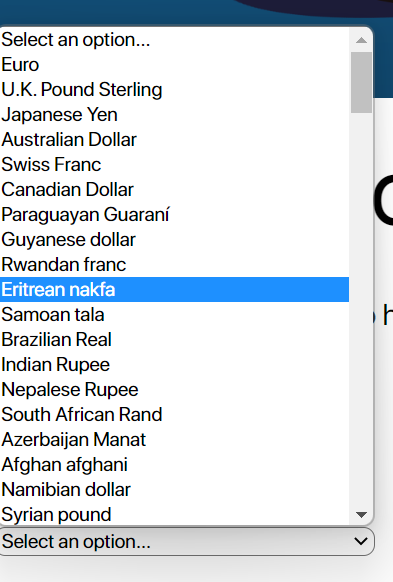
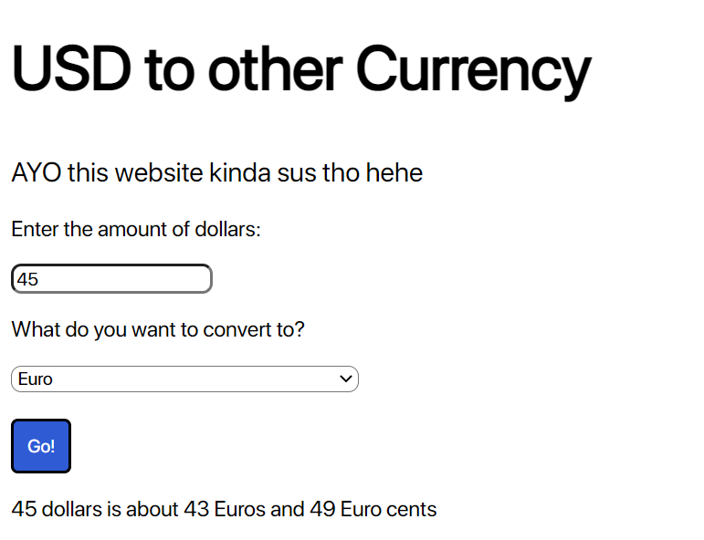

# Currency Converter
You can convert United States Dollars to any other currency.
All you have to do is:

Enter the number of dollars

Select the currency you are going to convert to

Press "Go!"

Your all set!

